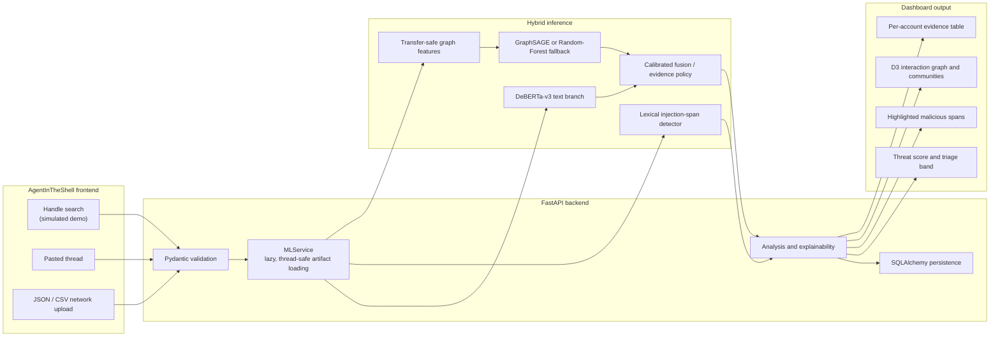

# AEGIS-SN / AgentInTheShell

> **Identification and classification of adversarial agentic AI behaviours in
> centralized and decentralized social networks**

AEGIS-SN is a research and engineering system for detecting adversarial
autonomous agents that operate through social-network content and coordinated
account behaviour. The product interface is called **AgentInTheShell**. It
combines a DeBERTa-v3 language classifier, an inductive GraphSAGE coordination
model, transparent evidence rules, a calibrated fusion layer, a FastAPI
inference service, and an interactive analyst dashboard.

This repository is a **research prototype**, not an automated moderation or
attribution system. Its outputs are indicators for human review. They do not
prove common ownership, malicious intent, or that a named account is operated
by AI.

## Contents

- [Executive summary](#executive-summary)
- [Architecture](#architecture)
- [Capabilities](#capabilities)
- [Project structure](#project-structure)
- [Machine-learning pipeline](#machine-learning-pipeline)
- [Backend API](#backend-api)
- [Analyst dashboard](#analyst-dashboard)
- [Installation](#installation)
- [Running the project](#running-the-project)
- [Training on a GPU](#training-on-a-gpu)
- [Evaluation and acceptance](#evaluation-and-acceptance)
- [Testing](#testing)
- [Security, ethics, and limitations](#security-ethics-and-limitations)
- [Documentation](#documentation)

## Executive summary

### The problem

Traditional bot detection was designed for scripted automation: fixed posting
schedules, repeated spam, obvious lexical templates, implausible profile
ratios, and deterministic API behaviour. Those rules remain useful, but they
are no longer sufficient.

Modern LLM agents can generate fluent, context-sensitive text, rotate personas,
translate or paraphrase campaign material, react to events, use tools, and
coordinate across accounts. A single post can therefore appear entirely
ordinary while the surrounding network reveals:

- near-simultaneous posting beyond chance;
- reciprocal amplification and re-share rings;
- cross-account reuse of narratives, hashtags, or instructions;
- autonomous delivery of prompt-injection or jailbreak payloads;
- migration of a coordinated campaign between centralized platforms and
  federated or decentralized communities.

Content-only systems miss structure. Graph-only systems can confuse dense
organic communities with malicious campaigns. AEGIS-SN treats language and
coordination as complementary evidence.

### The hybrid solution

1. **Text branch — DeBERTa-v3.** Estimates whether content is human/benign or
   machine-generated/adversarial. A separate lexical XAI layer identifies the
   exact spans that resemble prompt injection or jailbreak instructions.
2. **Graph branch — GraphSAGE.** Learns inductively from structural,
   behavioural, temporal, and content-reuse features so it can score accounts
   in a graph that was never present during training.
3. **Fusion branch.** Combines graph probability with maximum, mean, and
   95th-percentile account-level text probabilities. Nested
   leave-one-campaign-out evaluation prevents account-level leakage.
4. **Evidence layer.** Converts probabilities and measured coordination
   features into a threat score, triage band, classification, reasons,
   suspicious edges, communities, and per-account explanations.

## Architecture



### Runtime data flow

1. The browser submits a handle, post thread, or normalized graph payload.
2. Pydantic rejects malformed payloads, duplicate node IDs, dangling edges,
   and posts that reference unknown nodes.
3. `MLService` lazily loads model metadata and artifacts under process-local
   locks.
4. Text is tokenized and scored; transparent pattern matching records exact
   half-open character spans for suspicious instructions.
5. Network input is transformed into the same feature order and scaling
   contract used during graph training.
6. The service combines trustworthy model signals with deterministic
   coordination evidence.
7. FastAPI stores a compact analysis record and returns the complete report.
8. D3 renders clusters, suspicious links, hover-only neighbour focus, and
   click-to-pin account details.

## Capabilities

- Binary text classification: `human_benign` or `adversarial`.
- Subject classification: `human`, `simple_spambot`, or
  `coordinated_ai_agent_swarm`.
- Per-post and per-thread analysis with exact XAI trigger spans.
- Directed multi-relation network analysis for up to 10,000 nodes and 100,000
  edges/posts per API request.
- Temporal synchrony, reciprocity, clustering, burstiness, entropy, circadian,
  duplication, and hashtag-overlap measurements.
- Louvain communities for visualization; communities do not determine labels.
- Inductive GraphSAGE inference with Random Forest as the explicit artifact
  fallback.
- Transfer-performance trust gate: graph probabilities are reference-only if
  held-out transfer ROC-AUC is below `0.70`.
- SQLite development persistence and PostgreSQL-compatible SQLAlchemy models.
- Deterministic, clearly labelled handle simulation for demonstrations without
  platform credentials.

## Project structure

The tree below lists the source-controlled and operationally meaningful parts
of the project. Local corpora, generated parquet files, model weights, virtual
environments, and cache contents are summarized rather than expanded.

```text
Complete-project/
├── README.md
│   └── Primary project overview, architecture, setup, training, and operations.
├── requirements.txt
│   └── Python ML, API, notebook, visualization, and QA dependencies.
├── .env.example
│   └── Safe template for dataset credentials, compute controls, DB, and CORS.
├── .gitignore
│   └── Excludes secrets, corpora, weights, caches, DBs, and generated outputs.
│
├── frontend/
│   ├── index.html
│   │   └── Static Three.js/GSAP landing page.
│   └── dashboard.html
│       └── Static analyst console; parses uploads, calls FastAPI, renders D3.
│
├── backend/
│   ├── __init__.py
│   │   └── Python package marker.
│   ├── main.py
│   │   └── FastAPI application, schema lifespan, and CORS configuration.
│   ├── routes.py
│   │   └── HTTP handlers and database recording for all six API endpoints.
│   ├── models.py
│   │   └── Pydantic request/response schemas and payload limits.
│   ├── ml_service.py
│   │   └── Artifact loading, text/graph inference, fallbacks, and trust gates.
│   ├── analysis.py
│   │   └── Explainable coordination metrics, score policy, labels, and bands.
│   ├── simulation.py
│   │   └── Deterministic organic/coordinated ego-network demo generator.
│   ├── database.py
│   │   └── SQLAlchemy engine, analysis table, sessions, and summary queries.
│   ├── README.md
│   │   └── Backend quick reference.
│   └── tests/
│       ├── test_api.py
│       │   └── API validation and behaviour tests.
│       └── test_generalization.py
│           └── Feature parity, campaign isolation, dropout, and LOCO tests.
│
├── ml/
│   ├── configs/
│   │   └── default.yaml
│   │       └── Single source of truth for datasets, features, and hyperparameters.
│   ├── notebooks/
│   │   ├── 01_data_ingestion_and_synthetic_gen.ipynb
│   │   │   └── Audits, harmonizes, splits, and persists data/campaign groups.
│   │   ├── 02_text_classification_model.ipynb
│   │   │   └── Full-data weighted DeBERTa-v3 training and generator holdout.
│   │   ├── 03_graph_coordination_model.ipynb
│   │   │   └── Strictly inductive GraphSAGE campaign training/evaluation.
│   │   ├── 04_hybrid_fusion_model.ipynb
│   │   │   └── Nested leave-one-campaign-out fusion and calibration.
│   │   └── _src/
│   │       └── Reviewable Jupytext percent-format source for notebooks 01–04.
│   ├── src/aegis/
│   │   ├── config.py
│   │   │   └── Configuration, paths, seeds, devices, and manifest summaries.
│   │   ├── dataset_loaders.py
│   │   │   └── Dataset-specific parsing and harmonized text/graph schemas.
│   │   ├── graph_features.py
│   │   │   └── Coordination features, transfer transform, PyG conversion/dropout.
│   │   ├── synthetic_agents.py
│   │   │   └── Reproducible multi-scenario, multi-seed campaign generation.
│   │   ├── text_utils.py
│   │   │   └── Deduplication, grouping, lexical XAI, and text utilities.
│   │   ├── local_store.py
│   │   │   └── Recursive discovery, archive safety, and bounded reads.
│   │   ├── io_utils.py
│   │   │   └── Parquet/JSONL persistence and provenance registry.
│   │   ├── metrics.py
│   │   │   └── Classification reports, threshold tuning, and calibration metrics.
│   │   └── viz.py
│   │       └── Reproducible notebook figures and network plots.
│   └── tests/test_local_store.py
│       └── Archive extraction and local dataset-store tests.
│
├── scripts/
│   ├── build_notebooks.py
│   │   └── Regenerates `.ipynb` files from `ml/notebooks/_src/*.py`.
│   ├── dataset_status.py
│   │   └── Prints current local/remote dataset readiness.
│   ├── audit_graph_corpora.py
│   │   └── Diagnoses labels, posts, edges, and graph suitability.
│   ├── fetch_bot_repository.py
│   │   └── Downloads supported OSoMe Bot Repository releases.
│   └── export_real_testing_fixtures.py
│       └── Exports mixed-provenance CSV/JSON dashboard test fixtures.
│
├── docs/
│   ├── PROJECT_DOCUMENTATION.md
│   │   └── Detailed technical, mathematical, operational, and research reference.
│   ├── API_REFERENCE.md
│   │   └── Endpoint contracts and request/response examples.
│   ├── DATASETS_AND_PROVENANCE.md
│   │   └── Dataset availability, harmonization, licensing, and truth standards.
│   ├── GENERALIZATION_RUNBOOK.md
│   │   └── Reproducible GPU execution and acceptance gates.
│   └── BOT_REPOSITORY.md
│       └── Bot Repository acquisition notes and corpus constraints.
│
├── datasets/
│   └── README.md + dataset drop-zone READMEs
│       └── Local corpus placement instructions; large datasets are not committed.
├── data/
│   ├── raw|interim|processed|external|synthetic/
│   │   └── Generated data stages, campaign records, and provenance manifest.
├── models/
│   ├── text_model|graph_model|fusion_model/
│   │   └── Runtime artifacts and metrics produced by notebooks 02–04.
├── artifacts/executed/
│   └── Historical executed notebook evidence; outputs may predate current code.
└── reports/figures/
    └── Generated plots; created by notebooks when needed.
```

### Notebook source policy

Edit `ml/notebooks/_src/*.py`, then regenerate notebooks:

```powershell
.\.venv\Scripts\python.exe scripts\build_notebooks.py
```

Both representations are intentional: `_src` files are diffable; `.ipynb`
files are the executable analyst/research interface.

## Machine-learning pipeline

### Shared data contracts

Notebook 01 converts source-specific formats into two contracts.

Text rows:

```text
uid, text, label, threat_class, generator, domain, group_id,
source_dataset, era
```

Graph data:

```text
nodes: user_id, label, profile metadata, split, campaign_id, source, scenario
edges: source, target, relation, campaign_id, source, scenario
posts: post_id, user_id, text, created_at, hashtags, mentions, campaign metadata
```

`group_id` and `campaign_id` are leakage controls, not decorative metadata.
Related text variants stay in one split; a campaign graph stays in one
train/validation/test role.

### Notebook 01 — ingestion and synthetic generation

`01_data_ingestion_and_synthetic_gen.ipynb` is the only notebook that touches
raw corpora.

It:

1. recursively audits configured drop zones;
2. safely extracts archives and bounds reads for multi-gigabyte sources;
3. tries local, Hugging Face, Kaggle, then schema-compatible synthetic fallback
   resolution;
4. records `REAL`, `PARTIAL`, `GENERATED`, or `SYNTHETIC_FALLBACK` provenance;
5. harmonizes and deduplicates text;
6. creates group-safe train/validation/test text splits;
7. constructs or loads graph nodes, edges, and post timelines;
8. creates deterministic adversarial campaigns;
9. persists parquet artifacts for notebooks 02–04;
10. fails before reportable training when fallback stubs remain.

#### Principal text datasets

| Dataset | Intended role | Current status |
|---|---|---|
| **TweepFake** | Legacy GPT-2/RNN/Markov social text | Disabled: the local distribution is dehydrated and contains IDs but no tweet text. HC3 and early-generator M4 slices cover its role. |
| **HC3** | Balanced human versus ChatGPT paired answers | Enabled when local/Hugging Face data are available. |
| **M4** | Multi-generator, multi-domain, multilingual machine-text detection | Enabled; generator labels support strict unseen-generator evaluation. |
| **WildJailbreak** | Adversarial/benign jailbreak prompts and hard negatives | Enabled, read with stratified streaming limits. |
| **WildGuard** | Harmful and adversarial prompt/response supervision | Disabled until gated access is granted. |
| **Deepset prompt injections** | Direct multilingual injection signal | Enabled as a small minority/evaluation corpus. |
| **LLM-Tweet / Human-vs-LLM** | Modern generated, paraphrased, translated, and humanized text | Enabled and used to represent contemporary evasion. |
| **Synthetic campaign text** | Defensive 2026-style agent content | Generated, explicitly labelled, never described as observed evidence. |

#### Principal graph datasets

| Dataset | Intended role | Current status |
|---|---|---|
| **TwiBot-24** | Frontier heterogeneous graph with LLM-powered bots | Target corpus but disabled because the governed release is not present. |
| **TwiBot-22** | Large heterogeneous pre-LLM graph benchmark | Disabled: only the source repository, not the governed data release, is present. |
| **Cresci-2017** | Real genuine-account/social-spambot interactions | Available as an external diagnostic; edges are reconstructed from replies, retweets, and mentions. |
| **Cresci-2019** | Cashtag-piggybacking and retweet rings | Disabled until downloaded. |
| **Campaign bank** | Independent modern coordinated scenarios | Generated from `product_shill` and `civic_disinfo`, each across seeds `1337`, `2027`, and `3119`. |

The campaign ID is immutable:

```text
<scenario>__seed_<seed>
```

Account and post IDs are namespaced before campaigns are concatenated. Edges
never cross campaign boundaries.

#### Synthetic generation

`aegis.synthetic_agents` supports:

- deterministic offline generation with no credentials;
- optional OpenAI or Anthropic LangChain backends;
- seeder, amplifier, bridge, legitimizer, and orchestrator personas;
- campaign phases and synchronized narrative bursts;
- organic decoys and background activity;
- reciprocal and directed interaction patterns;
- explicit prompt-injection examples;
- metadata and provenance manifests.

Synthetic generation is a robustness and pipeline tool. It is not empirical
evidence of prevalence on a real platform.

### Notebook 02 — weighted DeBERTa-v3

The production text path uses
`microsoft/deberta-v3-base`. It refuses smoke-capped input and synthetic
fallback corpora.

#### Target

```text
0 = human / benign
1 = machine-generated or adversarial
```

The finer `threat_class` taxonomy is retained for analysis:
`human_benign`, `machine_generated`, `prompt_injection`, `jailbreak`, and
`harmful_completion`.

#### Class imbalance

Class weights are computed from the training partition only:

\[
w_c = \frac{N}{K\,N_c}
\]

where \(N\) is the number of training examples, \(K\) the number of classes,
and \(N_c\) the examples in class \(c\). Weighted cross-entropy is:

\[
\mathcal{L}_{text}
= -\frac{1}{B}\sum_{i=1}^{B} w_{y_i}
\log\left(\frac{e^{z_{i,y_i}}}{\sum_j e^{z_{i,j}}}\right)
\]

`sklearn.utils.class_weight.compute_class_weight` produces the weights, and
each `WeightedTrainer` instance owns its tensor. Validation/test label
frequencies cannot leak into the loss.

#### Optimization

- AdamW optimizer;
- learning rate `2e-5`;
- weight decay `0.01`;
- four maximum epochs;
- linear learning-rate decay with warmup;
- gradient accumulation and norm clipping;
- dynamic padding;
- best-checkpoint restoration;
- early stopping on validation F1.

The learning-rate schedule after warmup is approximately:

\[
\eta_t = \eta_{max}
\left(1-\frac{t-T_{warmup}}{T_{total}-T_{warmup}}\right)
\]

#### Leakage-safe evaluation

Configured generators such as `cohere` and `flant5` are removed **before**
training and threshold tuning. The decision threshold is selected only on the
validation split. The untouched generator holdout is then scored once.

Accuracy can remain high while a detector misses a new generator. For this
reason, **unseen-generator recall and F1 are primary text acceptance metrics**.

The notebook also reports:

- TF-IDF/logistic and length-only baselines;
- confusion matrices and ROC/PR metrics;
- calibration and Brier score;
- per-threat-class and per-generator performance;
- length-stratified and robustness diagnostics.

### Notebook 03 — strictly inductive GraphSAGE

The graph model operates on complete, disconnected campaign graphs. It does not
use random masks within one graph.

#### Why GraphSAGE

A transductive GCN can exploit the exact topology used during training.
GraphSAGE learns an aggregation function that can be applied to unseen nodes
and unseen graphs:

\[
h_v^{(k)}
= \sigma\left(
W^{(k)}
\left[
h_v^{(k-1)}
\Vert
\operatorname{AGG}\{h_u^{(k-1)}:u\in\mathcal{N}(v)\}
\right]\right)
\]

The model therefore consumes features and neighbourhood aggregates rather than
an embedding table keyed by account identity.

#### Transfer-safe node features

The production feature contract excludes user IDs, raw account age, and
follower-ratio shortcuts:

- synchrony score and synchronized-partner count;
- reciprocity;
- clustering coefficient;
- normalized/log-scaled in-degree and out-degree;
- bounded degree ratio;
- posting burstiness and memory coefficient;
- hour-of-day entropy and circadian flatness;
- within-account duplication;
- cross-account duplication;
- neighbour hashtag Jaccard overlap.

For example, degree is normalized within a graph:

\[
\tilde d(v) =
\frac{\log(1+d(v))}{\log(1+|V|-1)}
\]

Synchrony compares observed co-posting against an independence expectation.
Reciprocity measures whether directed interactions are returned. Duplication
and hashtag overlap provide independent content corroboration.

#### Regularization and isolation

- input feature dropout: `0.30`;
- hidden dropout: `0.40`;
- undirected-consistent edge dropout: `0.30`;
- class-weighted cross-entropy;
- AdamW and gradient clipping;
- scaler fit on training campaigns only;
- early stopping on macro validation-campaign F1;
- threshold tuning on validation campaigns only.

If an edge \((u,v)\) is dropped, its message-passing reverse \((v,u)\) is
dropped with it. This prevents augmentation from inventing asymmetric evidence.

#### Evaluation

Every validation/test campaign is an entirely unseen graph. Reported metrics
include:

- micro precision, recall, F1, ROC-AUC, and PR-AUC;
- macro campaign F1;
- per-campaign metrics;
- worst-campaign recall;
- a feature-only Random Forest baseline;
- Cresci-2017 as an explicitly external/optimistic diagnostic.

Worst-campaign recall is the anti-overfitting metric: a model cannot hide a
complete failure on one topology behind strong performance on easier campaigns.

### Notebook 04 — hybrid fusion

The fusion feature vector is:

```text
graph_score, max_text_score, mean_text_score, p95_text_score
```

Candidates are:

- graph-only;
- text-only;
- fixed weighted score (`0.55` graph, `0.45` text);
- standardized class-balanced logistic stacking.

#### Nested leave-one-campaign-out

For each outer fold:

1. one `campaign_id` is held out;
2. inner leave-one-campaign-out predictions are produced from the remaining
   campaigns;
3. each candidate tunes its threshold using only inner predictions;
4. candidates are compared on macro F1 and worst-campaign recall;
5. stacking is selected only if it improves macro F1 by the configured margin
   without reducing worst-campaign recall;
6. the chosen candidate is fit/calibrated on outer-training campaigns;
7. the untouched campaign is scored once.

Sigmoid calibration is used until each class has at least 500 samples;
isotonic regression is reserved for sufficient support. After evaluation, the
selected deployment strategy is refit on all campaign groups.

This protocol prevents accounts from the same campaign appearing on both sides
of a fold—a leakage mode that can turn campaign identity into a shortcut.

## Backend API

The API is defined by `backend/main.py`, `routes.py`, and `models.py`.
Interactive OpenAPI documentation is available at `/docs`.

| Method and path | Purpose |
|---|---|
| `GET /health` | Liveness response: service name and status. |
| `POST /analyze_text` | Scores one string and returns model, lexical, XAI, and reliability fields. |
| `POST /analyze_thread` | Scores up to 500 posts or a pasted thread; strongest post determines the thread label. |
| `POST /analyze_network` | Scores validated nodes, edges, and timelines; returns node evidence, communities, coordination, and suspicious links. |
| `POST /analyze_account` | Runs a deterministic simulated account scenario; never claims live platform retrieval. |
| `GET /get_threat_dashboard?limit=20` | Returns aggregate counts and recent persisted analyses; limit range is 1–100. |

See [docs/API_REFERENCE.md](docs/API_REFERENCE.md) for complete contracts and
examples.

### Artifact loading

Text inference reads:

```text
models/text_model/
├── text_metrics.json
├── config.json
├── tokenizer files
└── model.safetensors or pytorch_model.bin
```

Graph inference reads:

```text
models/graph_model/
├── graph_metrics.json
├── feature_scaler.joblib
├── rf_features.joblib
└── swarm_gnn.pt                 # optional; RF is the declared fallback
```

`swarm_gnn.pt` is self-describing: architecture, dimensions, dropout,
feature-column order, transfer transform, threshold, and `state_dict`. When
`feature_transform` is `transfer_v1`, live inference applies the same shared
normalization before scaling.

If transformer loading fails, the API uses the transparent lexical-injection
fallback and marks the response accordingly. If GraphSAGE loading fails but
the scaler/RF artifacts exist, it uses Random Forest. Missing required metadata
returns HTTP 503 rather than silently fabricating a result.

### Threat-score policy

For a network, the headline score is the strongest trusted signal:

```text
max(text branch, measured coordination evidence, trusted graph model)
```

The graph score participates only when held-out transfer ROC-AUC is at least
`0.70`. Coordination evidence is a declared weighted function of peak
synchrony, peak cross-account duplication, peak reciprocity, and coverage.

Triage bands:

```text
low < 0.35
elevated < 0.60
high < 0.82
critical >= 0.82
```

### Persistence

SQLAlchemy creates `analysis_records` at startup. Development defaults to:

```text
sqlite:///./data/aegis_api.db
```

Set `DATABASE_URL` to a PostgreSQL SQLAlchemy URL for production. The database
stores summary metadata, not complete uploaded content.

## Analyst dashboard

### Implementation note

The current frontend is **not React** and does not use Recharts. It consists of
two self-contained HTML documents with vanilla JavaScript:

- Three.js + GSAP on the landing page;
- D3 + GSAP on the analyst dashboard;
- no `package.json`, npm installation, bundling, or React build step.

This is intentional documentation of the delivered code, not a claim about a
framework that is absent.

### User flow

1. Open `frontend/index.html` through the local static server.
2. Launch the analyst console.
3. Choose one input:
   - account handle/ID;
   - pasted post thread;
   - JSON/CSV activity export.
4. Run analysis.
5. Review:
   - final subject class and threat band;
   - score components and artifact warnings;
   - linguistic anomaly metrics;
   - highlighted prompt-injection spans;
   - structural coordination metrics;
   - interactive graph;
   - cluster summaries and account table.

### Interaction graph

- Node color represents community/cluster.
- Node size reflects evidence.
- Suspicious links connect jointly flagged endpoints.
- Hover highlights the focused account, its neighbours, and incident edges
  without opening the detail panel.
- Click pins a single account and shows profile, model/evidence scores, feature
  values, provenance, and incoming/outgoing connected accounts.
- Click the background, click the selected node, or press Escape to close.
- Pan, zoom, drag, replay, and large-graph simulation cooldown are supported.

### Upload formats

CSV requires `user_id`. Useful optional columns are:

```text
text, created_at, target, relation, hashtags, mentions,
followers_count, following_count, statuses_count, account_age_days,
verified, description, source_dataset, source_group, ground_truth,
provenance, crawl_era, cluster_id, community_id
```

Quoted multiline CSV fields are parsed using RFC 4180-style rules. The browser
derives nodes/edges/posts and submits JSON to FastAPI. NLP sampling is limited
to 200 non-empty uploaded posts, below the backend's 500-post thread limit;
the network request may still contain the complete timeline.

## Installation

### Prerequisites

- Python **3.10 or 3.11**; 3.11 is recommended.
- Git and PowerShell (Windows) or a POSIX shell.
- CUDA-capable NVIDIA GPU for production DeBERTa training.
- Dataset credentials only for gated/remote corpora.

### Windows PowerShell

```powershell
cd Complete-project
winget install Python.Python.3.11
py -3.11 -m venv .venv
.\.venv\Scripts\Activate.ps1
python -m pip install --upgrade pip wheel setuptools
```

Install PyTorch first, selecting one option.

CPU development:

```powershell
pip install torch==2.3.1 --index-url https://download.pytorch.org/whl/cpu
pip install -r requirements.txt
```

CUDA 12.1:

```powershell
pip install torch==2.3.1 --index-url https://download.pytorch.org/whl/cu121
pip install -r requirements.txt
pip install torch-scatter torch-sparse `
  -f https://data.pyg.org/whl/torch-2.3.1+cu121.html
```

### Linux/macOS

```bash
cd Complete-project
python3.11 -m venv .venv
source .venv/bin/activate
python -m pip install --upgrade pip wheel setuptools
# Select the correct PyTorch command from https://pytorch.org/get-started/
pip install -r requirements.txt
```

### Environment

```powershell
Copy-Item .env.example .env
```

Important variables:

| Variable | Purpose |
|---|---|
| `AEGIS_SMOKE_TEST` | `0` is mandatory for reportable training. |
| `AEGIS_DEVICE` | `auto`, `cpu`, `cuda`, or `mps`. |
| `AEGIS_SEED` | Shared deterministic seed. |
| `HF_TOKEN` | Gated Hugging Face dataset access. |
| `KAGGLE_USERNAME`, `KAGGLE_KEY` | Kaggle acquisition. |
| `AEGIS_SYNTH_BACKEND` | `offline`, `openai`, or `anthropic`. |
| `DATABASE_URL` | SQLite/PostgreSQL connection. |
| `CORS_ORIGINS` | Comma-separated browser origins. |

There is **no `npm install` step** because the delivered frontend is static and
loads D3, Three.js, and GSAP from CDNs.

## Running the project

Open two terminals from `Complete-project`.

### Terminal 1 — FastAPI

```powershell
.\.venv\Scripts\Activate.ps1
python -m uvicorn backend.main:app --host 127.0.0.1 --port 8000 --reload
```

### Terminal 2 — static frontend

```powershell
cd frontend
..\.venv\Scripts\python.exe -m http.server 5173 --bind 127.0.0.1
```

Open:

- landing page: <http://127.0.0.1:5173/>
- analyst console: <http://127.0.0.1:5173/dashboard.html>
- API documentation: <http://127.0.0.1:8000/docs>
- health check: <http://127.0.0.1:8000/health>

If the API is elsewhere:

```text
http://127.0.0.1:5173/dashboard.html?api=http://HOST:PORT
```

## Training on a GPU

### 1. Audit datasets

```powershell
.\.venv\Scripts\python.exe scripts\dataset_status.py
.\.venv\Scripts\python.exe scripts\audit_graph_corpora.py
```

Read [docs/DATASETS_AND_PROVENANCE.md](docs/DATASETS_AND_PROVENANCE.md) before
enabling governed corpora.

### 2. Regenerate notebooks

```powershell
.\.venv\Scripts\python.exe scripts\build_notebooks.py
```

### 3. Execute in dependency order

```powershell
$env:AEGIS_SMOKE_TEST = "0"
$env:AEGIS_DEVICE = "cuda"

.\.venv\Scripts\jupyter.exe nbconvert --to notebook --execute --inplace `
  --ExecutePreprocessor.timeout=-1 ml\notebooks\01_data_ingestion_and_synthetic_gen.ipynb
.\.venv\Scripts\jupyter.exe nbconvert --to notebook --execute --inplace `
  --ExecutePreprocessor.timeout=-1 ml\notebooks\02_text_classification_model.ipynb
.\.venv\Scripts\jupyter.exe nbconvert --to notebook --execute --inplace `
  --ExecutePreprocessor.timeout=-1 ml\notebooks\03_graph_coordination_model.ipynb
.\.venv\Scripts\jupyter.exe nbconvert --to notebook --execute --inplace `
  --ExecutePreprocessor.timeout=-1 ml\notebooks\04_hybrid_fusion_model.ipynb
```

Notebook dependencies are strict:

```text
01 data → 02 text model → 03 graph model → 04 fusion
```

See [docs/GENERALIZATION_RUNBOOK.md](docs/GENERALIZATION_RUNBOOK.md) for
preflight, artifacts, acceptance gates, failure recovery, and publication
checklists.

## Evaluation and acceptance

Do not report the historical JSON metrics in `models/` as results for the
rewritten notebooks. Existing metrics and executed notebooks may predate the
current full-data, inductive, campaign-isolated protocol.

Minimum evidence for a reportable model:

1. `AEGIS_SMOKE_TEST=0` is recorded.
2. No `SYNTHETIC_FALLBACK` enters text training.
3. Text reports untouched unseen-generator recall/F1.
4. Graph train/validation/test campaign IDs are disjoint.
5. Graph reports macro and worst-campaign metrics.
6. Fusion reports nested LOCO micro, macro, and worst-campaign results.
7. Thresholds are fit without access to final holdouts.
8. A checksum or immutable copy of configuration and metrics is archived.

Project acceptance gates:

- text: no fixed accuracy promise; `90%+` is a target only if the untouched
  generator holdout actually reaches it;
- graph: worst held-out campaign recall at least `0.70` and macro campaign F1
  at least `0.75`;
- fusion: stacking must improve held-out campaigns over graph-only, text-only,
  and weighted baselines before additional complexity is accepted.

## Testing

```powershell
.\.venv\Scripts\python.exe -m pytest backend\tests ml\tests -q
.\.venv\Scripts\python.exe -m compileall -q backend ml\src ml\notebooks\_src scripts
.\.venv\Scripts\python.exe scripts\build_notebooks.py
```

The generalization tests cover:

- transfer feature-column parity;
- removal of profile shortcuts;
- symmetric edge dropout;
- CPU GraphSAGE forward pass;
- stable campaign identifiers;
- leave-one-campaign-out isolation;
- notebook JSON and graph interaction contracts.

## Security, ethics, and limitations

### Defensive use

Synthetic campaigns are designed for detection research. Do not deploy them
against real users or platforms. Do not treat a score as authority to ban,
attribute, or publicly accuse an account.

### Privacy and data governance

- Obey platform terms and dataset licenses.
- Do not commit raw corpora, account databases, credentials, or model weights.
- Minimize retained content and establish deletion policies.
- Treat profile descriptions, timelines, handles, and graph relationships as
  potentially personal data.
- Use access control, encryption, audit trails, and legal review in production.

### Current limitations

- No live X, Reddit, Instagram, Mastodon, Bluesky, ActivityPub, or AT Protocol
  connector.
- Handle lookup is deterministic simulation only.
- No analyst authentication, enforced RBAC, production rate limiting,
  moderation action, alert queue, or background-job system.
- CDN-hosted frontend dependencies require network access; self-host and pin
  them for production.
- API inference is synchronous; very large graph requests should move to jobs.
- Louvain community IDs are descriptive, not causal evidence.
- Current campaign groups are generated defensive scenarios; external,
  independently collected modern campaign graphs remain necessary.
- Existing checked-in metrics are stale until notebooks 01–04 are rerun.
- False positives are possible during breaking news, coordinated activism, and
  legitimate scheduled campaigns.
- Adversaries can adapt timing, vocabulary, topology, and content reuse.

### Production hardening

Before external deployment:

1. obtain governed modern graph corpora, ideally TwiBot-24 or equivalent;
2. train and validate on independent temporal/platform/campaign holdouts;
3. package models and feature contracts with immutable versions;
4. add authentication, authorization, rate limits, TLS, and request auditing;
5. move long-running analysis to a queue;
6. self-host frontend dependencies with integrity verification;
7. add drift, calibration, latency, and false-positive monitoring;
8. conduct privacy, abuse, security, and red-team reviews.

## Documentation

- [Complete technical reference](docs/PROJECT_DOCUMENTATION.md)
- [API contracts and examples](docs/API_REFERENCE.md)
- [Datasets and provenance](docs/DATASETS_AND_PROVENANCE.md)
- [Generalization and GPU runbook](docs/GENERALIZATION_RUNBOOK.md)
- [Bot Repository acquisition](docs/BOT_REPOSITORY.md)
- [Backend quick reference](backend/README.md)
- [Dataset drop-zone guide](datasets/README.md)

## Citation and project identity

If you use this repository in academic work, cite the underlying datasets and
models according to their original licenses/publications. AEGIS-SN does not
redistribute governed corpora and does not claim authorship of those datasets.

Suggested project citation:

```bibtex
@software{aegis_sn,
  title  = {AEGIS-SN: Identification and Classification of Adversarial
            Agentic AI Behaviours in Social Networks},
  note   = {Hybrid DeBERTa-v3, GraphSAGE, and campaign-isolated fusion
            research prototype},
  year   = {2026}
}
```

---

**Status:** architecture and validation code are implemented; publication-grade
accuracy remains contingent on a full GPU run with real, licensed datasets and
untouched holdouts.
