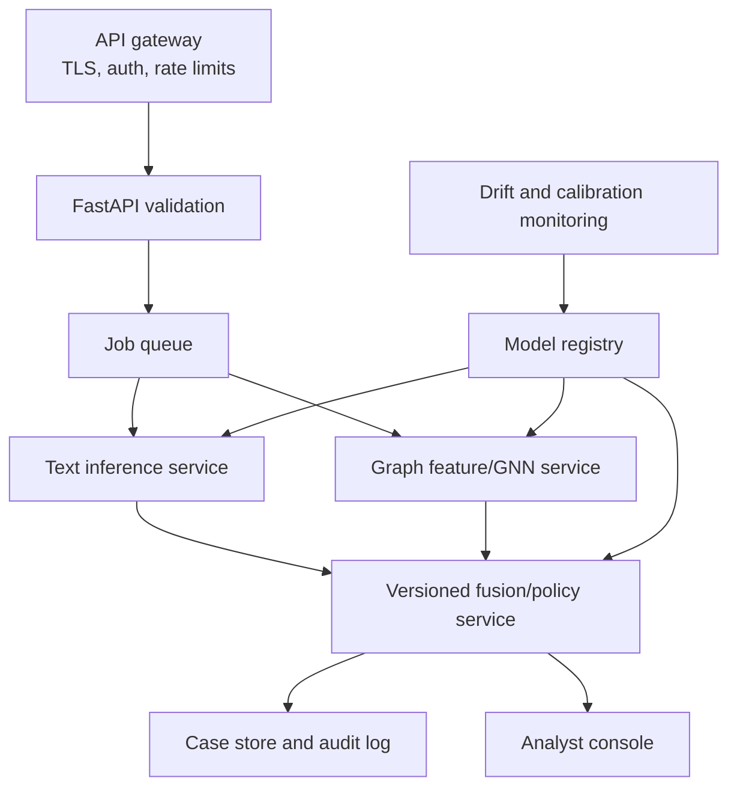

# AEGIS-SN Complete Technical Reference

This document is the detailed engineering and research reference for
**AEGIS-SN / AgentInTheShell**. Start with the repository
[`README.md`](../README.md) for installation and the full project overview.

## 1. Truth standard

The project distinguishes four data/artifact states:

- **REAL** — parsed from a downloaded source dataset.
- **PARTIAL** — real data intentionally row-capped for development.
- **GENERATED** — deliberate, labelled campaign simulation.
- **SYNTHETIC_FALLBACK** — schema-compatible stub used only to keep ingestion
  testable when a source is missing.

No metric trained or evaluated on `SYNTHETIC_FALLBACK` is reportable. Generated
campaign metrics measure performance on the simulator, not prevalence or
effectiveness on a real platform.

Likewise:

- **Implemented** means source code and a verification path exist.
- **Development-grade** means the path works but its artifact is not approved
  for production use.
- **External diagnostic** means the result provides context but cannot select
  the model.
- **Not implemented** is stated explicitly.

## 2. Scope and terminology

### 2.1 Agentic social behaviour

An agentic account is controlled wholly or partly by software that can select
goals, generate content, use tools, observe responses, and adapt subsequent
actions. The project focuses on adversarial behaviours such as:

- narrative seeding and coordinated amplification;
- trend or recommendation manipulation;
- persona-based cross-community influence;
- repetitive spam and scripted engagement;
- prompt injection aimed at downstream agents;
- coordinated evasion through paraphrase, translation, timing, and topology.

### 2.2 Centralized and decentralized networks

The data model is platform-neutral:

- a **node** is an account or identity;
- an **edge** is a directed relation such as reply, mention, quote, follow, or
  re-share;
- a **post** has an author, text, timestamp, hashtags, and mentions.

This contract can represent centralized feeds and federated/decentralized
communities. The repository does not include live platform connectors.

### 2.3 Operational labels

Text:

```text
human_benign
adversarial
```

Subject:

```text
human
simple_spambot
coordinated_ai_agent_swarm
```

The binary text target includes machine-generated and adversarial content
because both trigger analyst review. `threat_class` retains the finer semantic
category.

## 3. System decomposition

### 3.1 Presentation

`frontend/index.html` is the Three.js landing experience.
`frontend/dashboard.html` is the D3 analyst console. Both are static
HTML/CSS/JavaScript and load browser libraries from CDNs.

The frontend:

- normalizes handle/thread/upload input;
- parses JSON and RFC 4180-style CSV;
- derives nodes, edges, and posts when necessary;
- calls FastAPI;
- displays artifact trust and warnings;
- highlights exact lexical trigger spans;
- renders communities and suspicious links;
- provides hover neighbour focus and click-pinned account details.

### 3.2 Application service

`backend/main.py` owns FastAPI and CORS.
`backend/routes.py` maps requests to inference and persistence.
`backend/models.py` is the formal API contract.
`backend/ml_service.py` owns artifact lifecycle and inference.
`backend/analysis.py` owns deterministic interpretation.
`backend/database.py` stores analysis summaries.
`backend/simulation.py` supplies the clearly labelled handle demo.

### 3.3 ML research layer

`ml/configs/default.yaml` is the shared configuration source.
`ml/src/aegis/` contains reusable ingestion, feature, metric, and persistence
code. Notebook sources live under `ml/notebooks/_src/`; generated `.ipynb`
files are the execution interface.

## 4. Data engineering

### 4.1 Resolution order

For each enabled dataset:

```text
local → Hugging Face → Kaggle → synthetic fallback
```

Local files have priority because they provide reproducibility and avoid
surprise network calls. The manifest records the winning source and
provenance. Disabled datasets are not silently replaced.

### 4.2 Safety and scale

`aegis.local_store` and `dataset_loaders` provide:

- case-insensitive recursive discovery;
- safe archive extraction;
- suffix allowlists;
- bounded/chunked reads;
- dataset-specific column aliases;
- deterministic deduplication;
- dangling-edge and self-loop removal;
- explicit logging of dropped or unusable records.

Large releases are streamed or capped at read time rather than materialized
and truncated afterwards.

### 4.3 Text contract

| Field | Meaning |
|---|---|
| `uid` | Stable source-prefixed row identifier. |
| `text` | Utterance presented to the classifier. |
| `label` | `0` human/benign; `1` machine/adversarial. |
| `threat_class` | Fine-grained explanation category. |
| `generator` | Source generator/model; drives generator holdouts. |
| `domain` | Topic/domain when available. |
| `group_id` | Leakage group for variants/pairs/templates. |
| `source_dataset` | Corpus name. |
| `era` | Legacy, modern, frontier, or frontier-2026. |

### 4.4 Graph contract

Nodes contain identity, labels, profile/display metadata, split, and campaign
provenance. Edges contain source, target, relation, and campaign provenance.
Posts contain author, text, UTC timestamp, hashtags, mentions, and campaign
provenance.

Inference never requires a numeric node ID feature. IDs index rows and edges
only.

### 4.5 Campaign bank

`generate_campaign_bank` creates independent scenarios over multiple seeds:

```text
product_shill__seed_1337
product_shill__seed_2027
product_shill__seed_3119
civic_disinfo__seed_1337
civic_disinfo__seed_2027
civic_disinfo__seed_3119
```

Before concatenation:

- every user ID is prefixed with the campaign ID;
- every post ID is prefixed with the campaign ID;
- text group IDs are prefixed with the campaign ID;
- each edge endpoint remains inside one campaign.

This creates a bank of disconnected graphs rather than one graph with a
campaign column attached after message passing.

## 5. Text model methodology

### 5.1 Architecture

Notebook 02 fine-tunes `microsoft/deberta-v3-base` for two-class sequence
classification. DeBERTa improves on conventional transformer encoders through
disentangled representations of content and position.

The sequence classifier produces logits \(z_0,z_1\). The adversarial
probability is:

\[
p(y=1\mid x)=\frac{e^{z_1}}{e^{z_0}+e^{z_1}}
\]

### 5.2 Imbalance control

Only training labels determine class weights:

\[
w_c = \frac{N}{K N_c}
\]

The objective is:

\[
\mathcal{L} =
-\frac{1}{B}\sum_{i=1}^{B}
w_{y_i}\log p(y_i\mid x_i)
\]

This increases the gradient contribution of underrepresented classes without
resampling text or inspecting holdout frequencies.

### 5.3 Optimization

| Parameter | Value |
|---|---:|
| Base checkpoint | `microsoft/deberta-v3-base` |
| Maximum sequence length | 256 |
| Maximum epochs | 4 |
| Learning rate | `2e-5` |
| Weight decay | `0.01` |
| Scheduler | Linear decay with 6% warmup |
| Train batch | 16 |
| Gradient accumulation | 2 |
| Gradient norm | 1.0 |
| Early-stopping patience | 2 validation checks |
| Selection metric | Validation F1 |

Dynamic padding reduces wasted computation. FP16 is enabled automatically on
CUDA. Best-checkpoint restoration prevents the final epoch from being used
merely because it ran last.

### 5.4 Unseen-generator protocol

Configured generator substrings are matched before model or baseline fitting.
Matching positive examples are isolated. Human control examples are sampled
from the untouched test pool. Held-out generators are removed from training,
validation, and ordinary in-domain test data.

Threshold selection uses validation predictions only:

\[
\tau^\* =
\arg\max_{\tau\in[0,1]} F_\beta(y_{val},
\mathbb{1}[p_{val}\ge\tau])
\]

The holdout is scored with \(\tau^\*\) exactly once.

### 5.5 Explainability

Transformer probability is global to the sequence. It cannot localize which
words constituted an instruction. The service therefore adds an independent,
auditable lexical layer:

- text is split into sentence spans;
- known injection/jailbreak constructions are matched;
- exact start/end offsets are returned;
- the dashboard marks only those spans.

This is evidence localization, not a post-hoc claim that each marked token
caused the transformer output.

## 6. Graph model methodology

### 6.1 Feature families

#### Structural

In/out degree is log-scaled and normalized by graph size:

\[
\tilde d(v)=
\frac{\log(1+d(v))}
{\log(1+|V|-1)}
\]

Reciprocity for a node is the share of directed relationships whose reverse
also exists. Local clustering measures the closure of the neighbourhood.

#### Temporal

Posting burstiness uses inter-event intervals \(\Delta t\):

\[
B = \frac{\sigma_{\Delta t}-\mu_{\Delta t}}
{\sigma_{\Delta t}+\mu_{\Delta t}}
\]

Memory is the lag-one correlation of consecutive intervals. Posting entropy is
normalized Shannon entropy over hour-of-day bins:

\[
H = -\frac{\sum_{h=0}^{23}p_h\log_2 p_h}{\log_2 24}
\]

Circadian flatness is derived from the 24-hour Fourier amplitude.

#### Synchrony

Posts are assigned to short windows. For accounts \(u,v\), expected
co-occurrence under independence is approximately:

\[
E[C_{uv}]=
\frac{a_u a_v}{W}
\]

where \(a_u,a_v\) are active-window counts and \(W\) is the number of windows.
Observed co-occurrence is compared with this expectation so activity volume
alone cannot create a high score.

#### Content

Token Jaccard similarity is:

\[
J(A,B)=\frac{|A\cap B|}{|A\cup B|}
\]

It supports within-account duplication, cross-account duplication, and
neighbour hashtag-overlap features.

### 6.2 GraphSAGE

Each layer combines a node representation with an aggregation over its current
neighbours:

\[
h_v^{(k)}=\sigma\left(
W^{(k)}
[h_v^{(k-1)}\Vert
\operatorname{AGG}_{u\in\mathcal{N}(v)}
h_u^{(k-1)}]
\right)
\]

Because the parameters transform features and aggregates—not node lookup
embeddings—the same model can process a new topology.

### 6.3 Regularization

- feature dropout prevents dependence on one measurement;
- hidden dropout regularizes internal representations;
- symmetric edge dropout removes both message-passing directions of an
  undirected relation;
- weight decay constrains parameter growth;
- class weighting addresses label imbalance;
- gradient clipping stabilizes training.

### 6.4 Isolation

Training campaigns are converted to separate PyG `Data` objects and batched as
disconnected components. Validation and test graphs do not contribute nodes or
edges to training message passing. `StandardScaler` is fit only on the
concatenated training-campaign feature matrix.

### 6.5 Selection and reporting

Early stopping uses mean validation-campaign F1 at a fixed threshold. Threshold
tuning then uses validation campaigns. Test campaigns are untouched until the
final report.

The report contains:

- pooled/micro metrics;
- average/macro campaign F1;
- worst campaign and its metrics;
- per-campaign reports;
- feature-only baseline;
- Cresci external diagnostic.

## 7. Fusion methodology

### 7.1 Account representation

Post probabilities are aggregated per account:

- maximum score captures one dangerous payload;
- mean score represents overall language behaviour;
- 95th percentile reduces sensitivity to one extreme while retaining tail
  risk.

These three values join `graph_score`.

### 7.2 Nested LOCO

Let \(g_i\) be the campaign ID of account \(i\). Outer
`LeaveOneGroupOut` defines:

\[
\mathcal{D}_{test}^{(c)} =
\{(x_i,y_i):g_i=c\}
\]

All remaining campaigns form the outer training data. Inner LOCO creates
out-of-campaign predictions for model/threshold selection. The outer campaign
is evaluated only after all choices are fixed.

### 7.3 Candidate policy

Simple graph, text, and weighted candidates are compared with logistic
stacking. Stacking is accepted only when:

- macro campaign F1 improves by the configured minimum;
- worst-campaign recall does not decrease.

Calibration is sigmoid for limited support and isotonic only when the minimum
class count reaches the configured threshold.

### 7.4 Final refit

Cross-validated predictions remain the reported evidence. Only after evaluation
does notebook 04 refit the selected strategy on all campaigns for deployment.
The refit artifact must not be evaluated on its own fitting data and presented
as a holdout result.

## 8. Inference contracts

### 8.1 Text artifacts

`models/text_model/text_metrics.json` provides threshold, checkpoint,
artifact mode, maximum length, optimization metadata, and reports. Hugging Face
config/tokenizer/model files implement inference.

`artifact_reliable` is true only for a loadable
`finetuned_deberta_v3` artifact.

### 8.2 Graph artifacts

- `feature_scaler.joblib` — training-only scaler;
- `rf_features.joblib` — feature baseline/fallback;
- `swarm_gnn.pt` — model state and architecture contract;
- `graph_metrics.json` — feature order, transform, threshold, and transfer
  evidence.

The backend reconstructs GraphSAGE from checkpoint metadata. It uses
`transfer_v1` when declared by the metric artifact.

### 8.3 Fusion artifact

`fusion_model.joblib` stores:

- selected candidate kind;
- input feature names;
- threshold;
- calibration method;
- estimator or fixed weights.

The current HTTP service applies a transparent runtime evidence policy and does
not yet load the notebook-04 fusion artifact. Integrating that artifact into
`MLService` is a production roadmap item; documentation does not imply
otherwise.

## 9. Backend behaviour

### 9.1 Request validation

- text length: 1–100,000 characters;
- thread: up to 500 posts or 200,000-character blob;
- network: 1–10,000 unique nodes;
- edges/posts: up to 100,000 each;
- every edge endpoint and post author must reference a submitted node;
- handle peers: 2–12.

### 9.2 Network interpretation

An account is a coordination participant when:

```text
synchrony >= 0.35
AND (cross-account duplication >= 0.30 OR reciprocity >= 0.50)
```

At least two participants are required for a swarm classification. A lone
account may be classified as a simple spambot based on burstiness or extreme
following/follower imbalance.

The evidence score is:

```text
0.35 × peak synchrony
+ 0.30 × peak cross-account duplication
+ 0.15 × peak reciprocity
+ 0.20 × coordinated-account coverage
```

Each contribution is bounded to `[0,1]`.

### 9.3 Failure policy

- missing required artifacts → HTTP 503;
- unavailable transformer → lexical fallback plus warning;
- unavailable GNN → Random Forest fallback plus warning;
- insufficient edges/posts → incomplete-evidence warning;
- graph transfer AUC below 0.70 → graph score shown but excluded from headline.

## 10. Frontend behaviour

### 10.1 Landing page

Three.js draws a decorative interaction network. Raycasting exposes direct
connections. GSAP handles finite interaction/scroll animation and respects
reduced-motion settings.

### 10.2 Dashboard

The console provides:

- persistent dark/light theme;
- API health indicator;
- handle, thread, JSON, and CSV modes;
- drop zone and parsed-input status;
- threat report and reason list;
- linguistic and structural metric cards;
- exact XAI highlights;
- cluster-aware D3 graph;
- per-account table.

On dense graphs, labels and entrance animation are reduced, force simulation
cools faster, links are excluded from pointer hit-testing, and the graph card
is excluded from GSAP 3D repaint effects.

### 10.3 Graph semantics

Hover is navigation, not inspection: it highlights one-hop neighbours and
incident edges. Click is inspection: it opens a pinned detail card and scrolls
to the matching account row. This separation prevents a large tooltip from
covering the topology while the analyst explores connections.

## 11. Persistence

The application persists:

```text
id, analysis_type, score, label, details_json, created_at
```

`GET /get_threat_dashboard` derives total/text/network counts, adversarial
findings, mean score, and recent records. Uploaded raw payloads are not stored
by this table.

SQLite is suitable for local development. PostgreSQL is supported through
`DATABASE_URL`; migrations, retention, access control, backups, and encryption
must be added for production.

## 12. Reproducibility

Sources of control:

- one YAML configuration;
- deterministic project and campaign seeds;
- stable campaign IDs;
- immutable group-aware splits;
- saved scaler and feature order;
- self-describing checkpoints;
- notebook source mirrors;
- data manifest with provenance.

For a publication, archive:

- commit hash or source snapshot;
- environment lock/export;
- exact YAML;
- manifest and dataset checksums where licensing permits;
- executed notebooks;
- metrics JSON;
- model/checkpoint checksums;
- hardware and training duration.

## 13. Verification matrix

| Concern | Verification |
|---|---|
| API contracts | `backend/tests/test_api.py` |
| Feature order/profile exclusion | `test_transfer_feature_contract_excludes_profile_shortcuts` |
| Edge augmentation | `test_undirected_edge_dropout_keeps_reverse_pairs_consistent` |
| CPU model compatibility | `test_cpu_graphsage_forward_uses_transfer_feature_width` |
| Campaign provenance | `test_campaign_id_is_stable_and_persisted_on_all_graph_tables` |
| Fold isolation | `test_leave_one_campaign_out_has_no_group_overlap` |
| Notebook/UI contract | `test_notebooks_and_dashboard_encode_generalization_contract` |
| Archive safety | `ml/tests/test_local_store.py` |

## 14. Known gaps

1. Current model metrics may belong to historical notebook code.
2. Production DeBERTa training requires a GPU run.
3. Campaign-bank graphs are generated, not independently observed campaigns.
4. TwiBot-24 is not available locally.
5. Notebook-04 fusion is not wired into the HTTP runtime.
6. The frontend relies on external CDNs.
7. The API is synchronous and has no worker queue.
8. Authentication/rate-limit dependencies are listed, but enforcement is not
   implemented in the app.
9. No live platform acquisition connectors exist.
10. Drift, calibration monitoring, and temporal backtests are not automated.

## 15. Recommended research extensions

- add independently collected campaign graphs from multiple platforms;
- add temporal and cross-platform holdouts;
- compare GraphSAGE with relation-aware and temporal GNNs under the same split;
- measure performance at fixed false-positive rates;
- calibrate and monitor by platform/domain;
- add adversarial timing/content perturbation tests;
- evaluate community-level rather than only node-level decisions;
- report confidence intervals over campaign seeds;
- conduct blinded analyst usefulness studies.

## 16. Recommended production architecture



## 17. Troubleshooting

### API unreachable

Verify:

```powershell
Invoke-WebRequest http://127.0.0.1:8000/health
```

Ensure the dashboard's origin is in `CORS_ORIGINS` and use
`?api=http://HOST:PORT` when the API is not on port 8000.

### Browser shows old graph behaviour

Use `Ctrl+Shift+R` or append a cache-busting query parameter. Static servers
serve file changes immediately, but browsers may retain HTML.

### Notebook 02 refuses to start

This is expected when `AEGIS_SMOKE_TEST=1`, fallback data remain, or configured
holdout generators match no rows. Fix the upstream data; do not weaken the
gate.

### DeBERTa tokenizer fails

Use Python 3.11 and ensure `sentencepiece` and `protobuf` are installed.

### CUDA unavailable

```powershell
.\.venv\Scripts\python.exe -c "import torch; print(torch.cuda.is_available(), torch.version.cuda)"
```

Reinstall the correct CUDA PyTorch wheel if false.

### Graph report is reference-only

Open `models/graph_model/graph_metrics.json`. The backend requires unseen
transfer ROC-AUC `>=0.70`. Retraining in-domain without improving campaign
transfer will not clear the gate.

## 18. Gemini export checklist

Include:

- root `README.md`;
- complete `docs/`;
- `backend/`, `frontend/`, `ml/src/`, `ml/notebooks/_src/`, and `scripts/`;
- generated `.ipynb` files when notebook presentation matters;
- `requirements.txt`, `.env.example`, and `ml/configs/default.yaml`;
- metric JSON files only with the warning that they may be historical.

Exclude:

- `.venv/`, caches, local databases, secrets, raw licensed corpora, and model
  weights unless transfer is explicitly permitted;
- live API keys and Kaggle credentials;
- account data that cannot legally or ethically be shared.

Suggested review instruction:

```text
Audit AEGIS-SN against README.md, docs/PROJECT_DOCUMENTATION.md,
docs/DATASETS_AND_PROVENANCE.md, docs/API_REFERENCE.md, and
docs/GENERALIZATION_RUNBOOK.md. Treat generated campaign data as simulation,
historical metrics as stale until rerun, and validate claims directly against
backend/, frontend/, ml/notebooks/_src/, and ml/src/aegis/.
```
